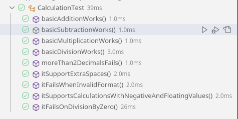

# Calculation protocol
This is the protocol specification of a simple calculation server that supports 2 operands calculation with various formats. We are using TCP and Java sockets. This is the role of the server to close the connection after the calculation is done. It means only one calculation can be done by the server. After the connection is established, the server send a welcome message back.

## Welcome message
It's nice to give servers a human sense so here is the message the server sends after the connection is opened by the client:
```
Welcome to SuperCalculationServer !

You can do the following calculations.
- Sum: <operand 1> + <operand 2>
- Substraction: <operand 1> - <operand 2>
- Multiplication: <operand 1> * <operand 2>
- Division: <operand 1> / <operand 2>

```

## Features
1. **Various numbers formats**
   1. Multiple digits supports
   1. Only supports 2 operands, it the client gives more it will fail the validation
   1. Sign support (`+` or `-` or nothing)
   1. Floating numbers with at max 2 decimals in the request and answer
1. **Supported calculations**
   1. A sum: `5 + 15` and server answers `20`
   1. A substraction: `15 + -2` and server answers `17`
   1. A multiplication: `-1.50 *4` and server answers `-6`
   1. A division: `10/3` and server answers `3.34` (the value is rounded to the nearest 2 decimals value -> `3.3333333` rounded to `3.34`)
1. **Validation**
   1. The request format must match the following regular expression:  
   `^([+-]?(\d+(\.\d{1,2})?))\s*[+-/*]\s*([+-]?(\d+(\.\d{1,2})?))$`.  
   1. Spaces around the operators are optional (valid examples: `5*    3`, `5*3`, `5  *  3`, `5*3`)
   1. The value can contains optionnaly spaces before and after, the line read is trimmed (`String.trim()`) before we try to validate it with our regex
1. **Errors management:**
   1. Server timeout: The client doesn't send anything under 2 seconds, the server responds with `error: timeout`.
   1. Client timeout: once the connection is opened there 3 possible ways to generate a timeout after 2 seconds because the server doesn't reply. In each case the client just closes the connection.:
      1. The server doesn't send the welcome message
      1. The server doesn't send the result of the calculation
      1. The server doesn't close the connection after sending back the result
   1. In case the calculation fails, the server responds with `error: calculation`
   1. In case the format is invalid (doesn't match the regex), the server responds with `error: format`

**Note: actually timeouts are hard to implement so we gave up on this feature.**

## Sequence diagrams
**A few diagrams to showcase the above features**

Valid format:
```mermaid
sequenceDiagram
	client->>server: Open connection
	server->>client: Send back the welcome message
	client->>server: Send a calculation like `5*3`
	server->>client: Give back the answer: `15`
	server->>client: Close the connection
```

Invalid format:
```mermaid
sequenceDiagram
	client->>server: Open connection
	server->>client: Send back the welcome message
	client->>server: Send a wrong string `invalid numbers...`
	server->>client: Give back the error: `error: format`
	server->>client: Close the connection
```

Client timeout error (1 of the 3 cases):
```mermaid
sequenceDiagram
	client->>server: Open connection but the server <br>doesn't reply with the welcome message
	client->>server: After 2 seconds there is <br>a client timeout -> close the connection
```

Server timeout error:
```mermaid
sequenceDiagram
	client->>server: Open connection but doesn't <br>send anything under 2 seconds
	server->>client: Send back the welcome message
	server->>client: Give back the error: `error: timeout`
	server->>client: Close the connection
```

Calculation error:
```mermaid
sequenceDiagram
	client->>server: Open connection
	server->>client: Send back the welcome message
	client->>server: Send a wrong string `10 / 0`
	server->>client: Give back the error: `error: calculation`
	server->>client: Close the connection
```

## Result
Only the server has been implemented because we were busy the last week...

The server seems to work pretty well:
```
$ telnet localhost 1234
Trying ::1...
Connected to localhost.
Escape character is '^]'.
Welcome to SuperCalculationServer !

You can do the following calculations.
- Sum: <operand 1> + <operand 2>
- Substraction: <operand 1> - <operand 2>
- Multiplication: <operand 1> * <operand 2>
- Division: <operand 1> / <operand 2>

10/3
3.33
Connection closed by foreign host.
```

```
Welcome to SuperCalculationServer !

You can do the following calculations.
- Sum: <operand 1> + <operand 2>
- Substraction: <operand 1> - <operand 2>
- Multiplication: <operand 1> * <operand 2>
- Division: <operand 1> / <operand 2>

-10.32/-0.1
103.20
Connection closed by foreign host.
```

```
Welcome to SuperCalculationServer !

You can do the following calculations.
- Sum: <operand 1> + <operand 2>
- Substraction: <operand 1> - <operand 2>
- Multiplication: <operand 1> * <operand 2>
- Division: <operand 1> / <operand 2>

asdfjklsda
error: format
Connection closed by foreign host.
```

```
Welcome to SuperCalculationServer !

You can do the following calculations.
- Sum: <operand 1> + <operand 2>
- Substraction: <operand 1> - <operand 2>
- Multiplication: <operand 1> * <operand 2>
- Division: <operand 1> / <operand 2>

10 / 0
error: calculation
Connection closed by foreign host.
```

**We wrote some unit tests on the sent string to make sure it is correctly validated, parsed and calculated !**

